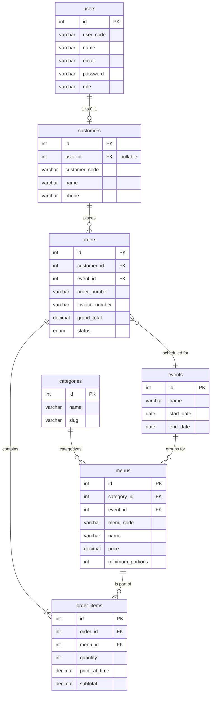

# Models & Database Schema

Siwayut Catering uses a custom `BaseModel` class that provides ActiveRecord-like functionality on top of raw PDO. There is no heavy ORM (like Eloquent or Doctrine), ensuring maximum performance and full control over SQL queries.

## Entity Relationship Diagram (ERD)

---

## BaseModel Architecture

The `BaseModel` (`src/Models/BaseModel.php`) handles the core PDO connection and provides standard CRUD methods.

### Properties
- `protected string $table`: The database table name.
- `protected array $fillable`: Allowed columns for insert/update (mass assignment protection).
- `protected array $sortableColumns`: Allowed columns for `ORDER BY` clauses.
- `protected array $searchableColumns`: Columns to search when using `LIKE %search%`.

### Standard Methods
- `all(string $orderBy = 'created_at', string $direction = 'DESC'): array`
- `find(int $id): ?array`
- `findWhere(array $conditions): ?array`
- `create(array $data): int`
- `update(int $id, array $data): bool`
- `delete(int $id): bool`
- `paginate(int $page, int $perPage, ...): array`
- `query(string $sql, array $bindings = []): array`
- `execute(string $sql, array $bindings = []): bool`

---

## Model Reference

### 1. User
- **Table:** `users`
- **Purpose:** Handles authentication and staff/admin accounts.
- **Custom Methods:**
  - `findByEmail(string $email): ?array`
  - Overrides `create()` to auto-generate `user_code` (`USR-XXXX`).

### 2. Customer
- **Table:** `customers`
- **Purpose:** Stores billing/delivery profiles. Guests get a customer record without a `user_id`. Registered users have a linked `user_id`.
- **Custom Methods:**
  - `findByUserId(int $userId): ?array`
  - `findByPhone(string $phone): ?array`
  - `linkUserByPhone(string $phone, int $userId): bool`
  - Overrides `create()` to auto-generate `customer_code` (`CST-YYMM-XXXX`).

### 3. Category
- **Table:** `categories`
- **Purpose:** Groups menus (e.g., Main Course, Dessert, Appetizer).

### 4. Event
- **Table:** `events`
- **Purpose:** Groups menus by occasion (e.g., Wedding Package, Corporate Box).
- **Custom Methods:**
  - `getActive(): array` — Returns only events with `status = 'active'`.

### 5. Menu
- **Table:** `menus`
- **Purpose:** Stores the catering products.
- **Custom Methods:**
  - `findByMenuCode(string $code): ?array`
  - `countByCategoryIds(array $ids): array` — Used in the dashboard to show item counts per category.
  - Overrides `paginate()` to include an `order_count` subquery.
  - Overrides `create()` to auto-generate `menu_code` (`MNU-XXXX`).

### 6. Order
- **Table:** `orders`
- **Purpose:** The core transactional entity.
- **Custom Methods:**
  - `findByOrderNumber(string $orderNumber): ?array`
  - `getByCustomerId(int $customerId): array`
  - `getItemsByOrderId(int $orderId): array` — Joins the `order_items` table.
  - `paginateForAdmin(...)`: Uses the shared `buildAdminQuery` helper for complex filtering.
  - `getAllForExport(...)`: Uses the shared `buildAdminQuery` helper for CSV exports.
  - Overrides `create()` to auto-generate `order_number` (`ORD-YYMM-XXXX`).

---

## Migration History

Database changes are managed sequentially via `php vanilla migrate`. Files are stored in `database/migrations/`.

| File | Description |
| :--- | :--- |
| `001_create_users_table.php` | Creates `users` table for admin/auth. |
| `002_create_categories_table.php` | Creates `categories` table. |
| `003_create_events_table.php` | Creates `events` table. |
| `004_create_menus_table.php` | Creates `menus` table with FK to categories/events. |
| `005_create_customers_table.php` | Creates `customers` table. |
| `006_create_orders_table.php` | Creates legacy `orders` table (initially single-item). |
| `007_add_payment_status_to_orders.php` | Adds payment tracking fields. |
| `008_add_user_id_to_customers_table.php` | Links customers to authenticated users. |
| `009_create_order_items_table.php` | **Crucial pivot:** Migrates orders from single-item to multi-item structure. |
| `010_drop_menu_id_quantity_from_orders.php` | Cleans up legacy single-item columns. |
| `011_add_pattern_codes_to_tables.php` | Adds human-readable string codes (`MNU-XXXX`, `ORD-XXXX`). |
| `012_add_occasion_to_orders.php` | Adds user-defined occasion string to orders. |
| `013_drop_event_id_from_orders.php` | Removes direct event link from orders (now handled per-menu). |
| `014` - `016` | Adds cost tracking (`cost_price`, `total_cost`) for profit calculation. |
| `017` - `020` | Adds Invoice Number, Tax, Discount, and granular payment details. |
| `021` - `023` | Adds phone/address to `users` and drops unused avatar. |

### Note on Foreign Keys
Foreign keys are strictly enforced (`ON DELETE RESTRICT` for referential integrity, and `ON DELETE CASCADE` for tightly bound child records like `order_items`).
