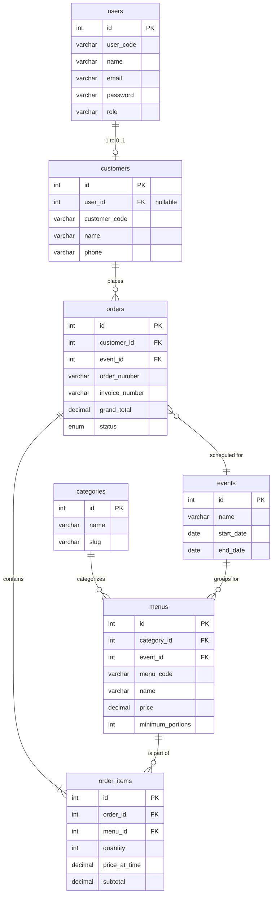

# Model & Skema Database

Siwayut Catering menggunakan kelas `BaseModel` kustom yang menyediakan fungsionalitas layaknya ActiveRecord di atas PDO murni. Tidak ada ORM yang berat (seperti Eloquent atau Doctrine), sehingga memastikan performa maksimal dan kontrol penuh atas query SQL.

## Entity Relationship Diagram (ERD)

---

## Arsitektur BaseModel

`BaseModel` (`src/Models/BaseModel.php`) menangani koneksi PDO inti dan menyediakan metode CRUD standar.

### Properti
- `protected string $table`: Nama tabel database.
- `protected array $fillable`: Kolom yang diizinkan untuk insert/update (perlindungan mass assignment).
- `protected array $sortableColumns`: Kolom yang diizinkan untuk klausa `ORDER BY`.
- `protected array $searchableColumns`: Kolom yang dicari saat menggunakan `LIKE %search%`.

### Metode Standar
- `all(string $orderBy = 'created_at', string $direction = 'DESC'): array`
- `find(int $id): ?array`
- `findWhere(array $conditions): ?array`
- `create(array $data): int`
- `update(int $id, array $data): bool`
- `delete(int $id): bool`
- `paginate(int $page, int $perPage, ...): array`
- `query(string $sql, array $bindings = []): array`
- `execute(string $sql, array $bindings = []): bool`

---

## Referensi Model

### 1. User
- **Tabel:** `users`
- **Tujuan:** Menangani autentikasi dan akun staf/admin.
- **Metode Kustom:**
  - `findByEmail(string $email): ?array`
  - Mengganti (override) `create()` untuk membuat `user_code` secara otomatis (`USR-XXXX`).

### 2. Customer
- **Tabel:** `customers`
- **Tujuan:** Menyimpan profil penagihan/pengiriman. Tamu mendapatkan record customer tanpa `user_id`. Pengguna terdaftar memiliki `user_id` yang tertaut.
- **Metode Kustom:**
  - `findByUserId(int $userId): ?array`
  - `findByPhone(string $phone): ?array`
  - `linkUserByPhone(string $phone, int $userId): bool`
  - Mengganti (override) `create()` untuk membuat `customer_code` secara otomatis (`CST-YYMM-XXXX`).

### 3. Category
- **Tabel:** `categories`
- **Tujuan:** Mengelompokkan menu (contoh: Main Course, Dessert, Appetizer).

### 4. Event
- **Tabel:** `events`
- **Tujuan:** Mengelompokkan menu berdasarkan acara (contoh: Wedding Package, Corporate Box).
- **Metode Kustom:**
  - `getActive(): array` — Mengembalikan event dengan `status = 'active'` saja.

### 5. Menu
- **Tabel:** `menus`
- **Tujuan:** Menyimpan produk katering.
- **Metode Kustom:**
  - `findByMenuCode(string $code): ?array`
  - `countByCategoryIds(array $ids): array` — Digunakan di dashboard untuk menampilkan jumlah item per kategori.
  - Mengganti (override) `paginate()` untuk menyertakan subquery `order_count`.
  - Mengganti (override) `create()` untuk membuat `menu_code` secara otomatis (`MNU-XXXX`).

### 6. Order
- **Tabel:** `orders`
- **Tujuan:** Entitas transaksional inti.
- **Metode Kustom:**
  - `findByOrderNumber(string $orderNumber): ?array`
  - `getByCustomerId(int $customerId): array`
  - `getItemsByOrderId(int $orderId): array` — Melakukan join ke tabel `order_items`.
  - `paginateForAdmin(...)`: Menggunakan helper `buildAdminQuery` bersama untuk pemfilteran kompleks.
  - `getAllForExport(...)`: Menggunakan helper `buildAdminQuery` bersama untuk ekspor CSV.
  - Mengganti (override) `create()` untuk membuat `order_number` secara otomatis (`ORD-YYMM-XXXX`).

---

## Riwayat Migrasi

Perubahan database dikelola secara berurutan melalui `php vanilla migrate`. File disimpan di `database/migrations/`.

| File | Deskripsi |
| :--- | :--- |
| `001_create_users_table.php` | Membuat tabel `users` untuk admin/auth. |
| `002_create_categories_table.php` | Membuat tabel `categories`. |
| `003_create_events_table.php` | Membuat tabel `events`. |
| `004_create_menus_table.php` | Membuat tabel `menus` dengan FK ke categories/events. |
| `005_create_customers_table.php` | Membuat tabel `customers`. |
| `006_create_orders_table.php` | Membuat tabel `orders` lama (awalnya single-item). |
| `007_add_payment_status_to_orders.php` | Menambahkan field pelacakan pembayaran. |
| `008_add_user_id_to_customers_table.php` | Menautkan customer ke user yang terautentikasi. |
| `009_create_order_items_table.php` | **Pivot krusial:** Memigrasikan order dari struktur single-item ke multi-item. |
| `010_drop_menu_id_quantity_from_orders.php` | Membersihkan kolom single-item lama. |
| `011_add_pattern_codes_to_tables.php` | Menambahkan kode string yang mudah dibaca manusia (`MNU-XXXX`, `ORD-XXXX`). |
| `012_add_occasion_to_orders.php` | Menambahkan string acara yang ditentukan pengguna ke order. |
| `013_drop_event_id_from_orders.php` | Menghapus tautan event langsung dari order (sekarang ditangani per-menu). |
| `014` - `016` | Menambahkan pelacakan biaya (`cost_price`, `total_cost`) untuk perhitungan laba. |
| `017` - `020` | Menambahkan Nomor Invoice, Pajak, Diskon, dan detail pembayaran granular. |
| `021` - `023` | Menambahkan telepon/alamat ke `users` dan menghapus avatar yang tidak digunakan. |

### Catatan tentang Foreign Keys
Foreign keys ditegakkan secara ketat (`ON DELETE RESTRICT` untuk integritas referensial, dan `ON DELETE CASCADE` untuk record anak yang terikat erat seperti `order_items`).